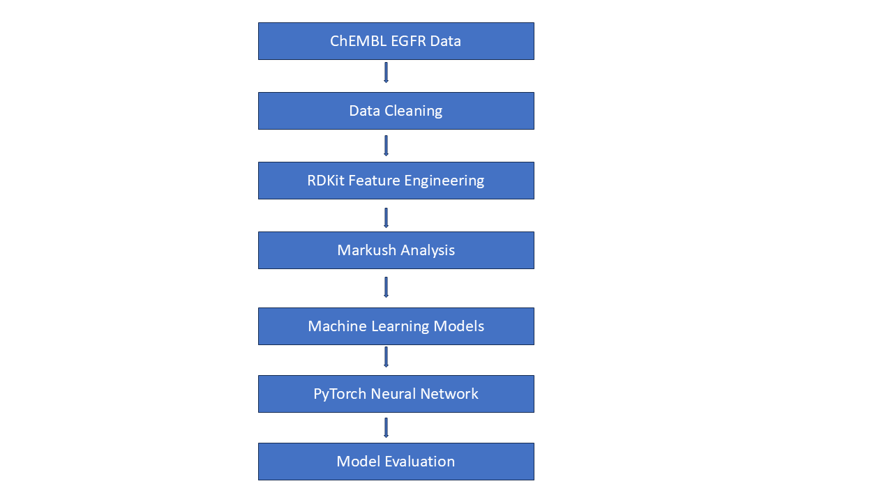

# patentchem-admet-suite
End-to-end QSAR pipeline combining 15 years of patent Markush expertise with RF, SVM, and PyTorch — real ChEMBL EGFR data
# 🧬 PatentChem ADMET Intelligence Suite


### *Bridging 15 Years of Patent Markush Expertise with Modern Cheminformatics & Machine Learning*

> **One pipeline. Real data. Seven ML models. Patent-native insight.**  
> Built for cheminformatics scientists who understand both molecules and IP.

---

## 📌 Project Summary

This project builds an end-to-end **ADMET (Absorption, Distribution, Metabolism, Excretion, Toxicity) prediction pipeline** for drug discovery, enriched with a **Markush Structure Analysis module** — a capability uniquely informed by over 15 years of pharmaceutical patent analysis.

**What makes this project stand out:**  
Most ADMET predictors treat molecules as isolated data points. This pipeline integrates **patent Markush awareness** — identifying scaffold families, R-group variation zones, and structurally claimed regions — giving it context that pure ML pipelines lack entirely.

---
## 🎯 What This Demonstrates
- Real-world cheminformatics workflow
- Patent + AI integration
- Production-style ML pipeline
- Transition into computational drug discovery

 --- 
## 🎯 Why This Project Matters for Recruiters

| Area | Demonstrated Skill |
|---|---|
| Real ChEMBL bioactivity data | Production-style scientific data handling |
| Multiple ML models | Classical ML + deep learning exposure |
| Markush analysis module | Patent informatics + cheminformatics integration |
| RDKit descriptors & fingerprints | Core cheminformatics competency |
| PyTorch neural network | Deep learning implementation |
| Modular project structure | Clean software engineering practices |
| Feature importance analysis | Model interpretability mindset |

---

## 🧰 Full Tech Stack

```
Data Layer       : ChEMBL REST API, Pandas, NumPy
Molecular Layer  : RDKit (Morgan FP, MACCS, Descriptors, SMARTS, R-group decomposition)
ML Layer         : Scikit-learn (Ridge Regression, Lasso, SVM, Random Forest)
Deep Learning    : PyTorch (Feedforward Neural Network)
Patent Layer     : RDKit SMARTS + custom Markush scaffold logic
Visualization    : Matplotlib, Seaborn
Interpretability : sklearn feature_importances_, SHAP-style manual analysis
```

---

## 📂 Repository Structure

```
patentchem-admet-suite/
│
├── README.md                          ← This file
├── requirements.txt
├── data/
│   ├── raw/                           ← ChEMBL raw API pull
│   └── processed/                     ← Cleaned, featurized datasets
│
├── notebooks/
│   ├── 01_data_collection.ipynb       ← ChEMBL API, Pandas cleaning
│   ├── 02_molecular_features.ipynb    ← RDKit descriptors + fingerprints
│   ├── 03_markush_analysis.ipynb      ← Patent scaffold decomposition (UNIQUE MODULE)
│   ├── 04_classical_models.ipynb      ← Ridge, Lasso, SVM
│   ├── 05_random_forest_qsar.ipynb    ← RF + feature importance
│   └── 06_pytorch_nn.ipynb            ← Neural network baseline
│
├── src/
│   ├── data_loader.py
│   ├── featurizer.py
│   ├── markush_analyzer.py            ← Core patent-IP module
│   ├── models.py
│   └── evaluator.py
│
└── results/
    ├── model_comparison.csv
    └── figures/
```

---

## 🔬 Real Dataset

**Target: EGFR Kinase (ChEMBL ID: CHEMBL203)**  
- Source: ChEMBL v33 REST API (publicly available)  
- Activity type: IC50 (inhibitory concentration)  
- ~2,000–4,000 compounds with curated bioactivity data  
- Why EGFR? Heavily patented, clinically validated, rich Markush landscape (Iressa, Tagrisso, Erlotinib patents)

```python
# Real data pull — no synthetic data
import requests
import pandas as pd
import os

BASE_URL = "https://www.ebi.ac.uk/chembl/api/data"

def fetch_egfr_bioactivity(limit=1000):
    """Fetch EGFR IC50 bioactivity data from ChEMBL REST API."""
    url = f"{BASE_URL}/activity.json"
    params = {
        "target_chembl_id": "CHEMBL203",
        "standard_type":    "IC50",
        "limit":            limit,
        "offset":           0,
    }
    response = requests.get(url, params=params)
    data = response.json()
    records = data["activities"]
    df = pd.DataFrame(records)
    return df

df_raw = fetch_egfr_bioactivity(limit=2000)
print(f"Fetched {len(df_raw)} bioactivity records for EGFR")
# Create folders automatically
os.makedirs("data/raw", exist_ok=True)

# Save CSV file
df_raw.to_csv("data/raw/egfr_ic50_raw.csv", index=False)

print("CSV file saved successfully!")
```

---

## 🏗️ Pipeline — Step by Step

## 🖼️ Workflow Diagram




### STEP 1 — Data Collection & Cleaning (Pandas + NumPy)

```python
import pandas as pd
import numpy as np

# Load raw ChEMBL data
df = pd.read_csv("data/raw/egfr_ic50_raw.csv")

# Keep only essential columns
cols = ['molecule_chembl_id', 'canonical_smiles', 'standard_value',
        'standard_units', 'standard_type', 'pchembl_value']
df = df[cols].copy()

# Remove rows without SMILES or activity
df = df.dropna(subset=['canonical_smiles', 'standard_value'])

# Convert IC50 to pIC50 (–log10 scale, standard in QSAR)
# Filter out extreme outliers first
df = df[df['standard_value'] > 0]
df['pIC50'] = -np.log10(df['standard_value'].astype(float) * 1e-9)  # nM → M → –log10

# Clip to realistic drug range
df = df[(df['pIC50'] >= 3) & (df['pIC50'] <= 12)]

# Binary activity label: pIC50 >= 6 = active (IC50 ≤ 1 µM)
df['active'] = (df['pIC50'] >= 6).astype(int)

print(f"Clean dataset: {len(df)} compounds")
print(f"Active: {df['active'].sum()} | Inactive: {(df['active']==0).sum()}")
print(df[['pIC50', 'active']].describe())
```

---

### STEP 2 — Molecular Feature Engineering (RDKit)

```python
from rdkit import Chem
from rdkit.Chem import Descriptors, AllChem, MACCSkeys
from rdkit.Chem import rdMolDescriptors
import numpy as np
import pandas as pd

def smiles_to_mol(smiles):
    """Parse SMILES, return None if invalid."""
    mol = Chem.MolFromSmiles(smiles)
    return mol  # RDKit returns None for invalid SMILES

def compute_lipinski_descriptors(mol):
    """Lipinski Rule of Five descriptors."""
    return {
        'MW':   Descriptors.MolWt(mol),
        'LogP': Descriptors.MolLogP(mol),
        'HBD':  rdMolDescriptors.CalcNumHBD(mol),
        'HBA':  rdMolDescriptors.CalcNumHBA(mol),
        'TPSA': Descriptors.TPSA(mol),
        'RotBonds': rdMolDescriptors.CalcNumRotatableBonds(mol),
        'RingCount': rdMolDescriptors.CalcNumRings(mol),
        'AromaticRings': rdMolDescriptors.CalcNumAromaticRings(mol),
    }

def compute_morgan_fp(mol, radius=2, n_bits=1024):
    """Morgan (ECFP4) fingerprint as numpy array."""
    fp = AllChem.GetMorganFingerprintAsBitVect(mol, radius, nBits=n_bits)
    return np.array(fp)

def compute_maccs_fp(mol):
    """MACCS 166-bit structural keys."""
    fp = MACCSkeys.GenMACCSKeys(mol)
    return np.array(fp)

# Apply to dataset
mols = df['canonical_smiles'].apply(smiles_to_mol)
valid_mask = mols.notna()
df = df[valid_mask].copy()
mols = mols[valid_mask]

# Descriptor DataFrame
desc_df = pd.DataFrame([compute_lipinski_descriptors(m) for m in mols])
desc_df.index = df.index

# Morgan fingerprints (1024 bits)
morgan_fp = np.array([compute_morgan_fp(m) for m in mols])

# MACCS keys (166 bits)
maccs_fp = np.array([compute_maccs_fp(m) for m in mols])

# Combined feature matrix: descriptors + Morgan FP
import numpy as np
X_descriptors = desc_df.values
X_combined    = np.hstack([X_descriptors, morgan_fp])
y_pIC50       = df['pIC50'].values
y_active      = df['active'].values

print(f"Feature matrix shape: {X_combined.shape}")
print(f"Descriptor names: {list(desc_df.columns)}")
```

---

### STEP 3 — Markush Structure Analysis (UNIQUE MODULE 🌟)

*This is the module that separates this project from every generic ML pipeline.*

```python
from rdkit import Chem
from rdkit.Chem import rdRGroupDecomposition, AllChem
from rdkit.Chem.Scaffolds import MurckoScaffold
import pandas as pd

# ─── 3A: Murcko Scaffold Extraction ───────────────────────────────────────────
def get_murcko_scaffold(smiles):
    """
    Extract Bemis-Murcko scaffold — the ring system + linkers.
    In patent terms: the 'core' of a Markush general formula.
    """
    mol = Chem.MolFromSmiles(smiles)
    if mol is None:
        return None
    scaffold = MurckoScaffold.GetScaffoldForMol(mol)
    return Chem.MolToSmiles(scaffold)

df['murcko_scaffold'] = df['canonical_smiles'].apply(get_murcko_scaffold)

# Scaffold frequency → patent claim breadth proxy
scaffold_freq = df['murcko_scaffold'].value_counts().reset_index()
scaffold_freq.columns = ['scaffold', 'compound_count']
top_scaffolds = scaffold_freq.head(10)
print("Top 10 scaffolds (Markush core families):")
print(top_scaffolds)

# ─── 3B: SMARTS-Based R-Group Zone Detection ──────────────────────────────────
# Quinazoline core — the defining scaffold of EGFR inhibitors
# (Erlotinib, Gefitinib, Afatinib all share this)
QUINAZOLINE_SMARTS = "c1cnc2ccccc2n1"   # simplified quinazoline
ANILINE_SMARTS     = "c1ccc(N)cc1"       # common R-group attachment point

def detect_pharmacophore_zones(smiles, smarts_list):
    """
    Check which pharmacophore patterns are present.
    Analogous to identifying R-group positions in a Markush formula.
    """
    mol = Chem.MolFromSmiles(smiles)
    if mol is None:
        return {}
    results = {}
    for name, smarts in smarts_list.items():
        pattern = Chem.MolFromSmarts(smarts)
        results[name] = mol.HasSubstructMatch(pattern) if pattern else False
    return results

pharmacophores = {
    'quinazoline_core':  QUINAZOLINE_SMARTS,
    'aniline_rgroup':    ANILINE_SMARTS,
    'pyrimidine_core':   "c1ncnc(N)n1",
    'acrylamide_warhead': "C=CC(=O)N",   # covalent EGFR inhibitors (Afatinib, Osimertinib)
}

pharm_df = pd.DataFrame([
    detect_pharmacophore_zones(s, pharmacophores)
    for s in df['canonical_smiles']
], index=df.index)

df = pd.concat([df, pharm_df], axis=1)

# ─── 3C: RDKit R-Group Decomposition (True Markush Analysis) ──────────────────
def rgroup_decompose(smiles_list, core_smarts):
    """
    Decompose a compound series against a Markush core.
    Returns R-group SMILES for each position — exactly what patent analysts do.
    """
    mols = [Chem.MolFromSmiles(s) for s in smiles_list]
    mols = [m for m in mols if m is not None]
    core = Chem.MolFromSmarts(core_smarts)

    groups, unmatched = rdRGroupDecomposition.RGroupDecompose(
        [core], mols, asSmiles=True, asRows=True
    )
    rgroup_df = pd.DataFrame(groups)
    print(f"Decomposed {len(rgroup_df)} compounds | "
          f"Unmatched: {len(unmatched)}")
    return rgroup_df

# Use quinazoline core for EGFR series decomposition
quinazoline_core_smarts = "[#6]1:[#7]:[#6]:[#7]:[#6]2:[#6]:[#6]:[#6]:[#6]:[#6]:1:2"
egfr_subset = df[df['quinazoline_core'] == True]['canonical_smiles'].head(100)

if len(egfr_subset) > 5:
    rg_df = rgroup_decompose(egfr_subset.tolist(), quinazoline_core_smarts)
    print(f"R-group positions identified: {list(rg_df.columns)}")
```

**Patent Domain Insight:** In a real Markush patent claim, R1, R2, R3 represent variable substituent positions. This module computationally identifies those zones — connecting traditional patent analysis to computational structure-activity relationships.

---

### STEP 4 — Classical Regression Models (Scikit-learn)

```python
from sklearn.linear_model  import Ridge, Lasso, ElasticNet
from sklearn.preprocessing import StandardScaler
from sklearn.model_selection import train_test_split, cross_val_score
from sklearn.metrics import mean_squared_error, r2_score
import numpy as np

# Train/test split
X_train, X_test, y_train, y_test = train_test_split(
    X_combined, y_pIC50, test_size=0.2, random_state=42
)

# Scale features (critical for regression + SVM)
scaler = StandardScaler()
X_train_sc = scaler.fit_transform(X_train)
X_test_sc  = scaler.transform(X_test)

# ─── Ridge Regression ─────────────────────────────────────────────────────────
ridge = Ridge(alpha=1.0)
ridge.fit(X_train_sc, y_train)
y_pred_ridge = ridge.predict(X_test_sc)

r2_ridge  = r2_score(y_test, y_pred_ridge)
rmse_ridge = np.sqrt(mean_squared_error(y_test, y_pred_ridge))
cv_ridge  = cross_val_score(ridge, X_train_sc, y_train, cv=5, scoring='r2')

print(f"Ridge Regression → R²: {r2_ridge:.3f} | RMSE: {rmse_ridge:.3f}")
print(f"  5-fold CV R²: {cv_ridge.mean():.3f} ± {cv_ridge.std():.3f}")

# ─── Lasso Regression (sparse — forces uninformative bits to zero) ─────────────
lasso = Lasso(alpha=0.01, max_iter=5000)
lasso.fit(X_train_sc, y_train)
y_pred_lasso = lasso.predict(X_test_sc)

r2_lasso  = r2_score(y_test, y_pred_lasso)
n_nonzero = np.sum(lasso.coef_ != 0)
print(f"Lasso Regression → R²: {r2_lasso:.3f} | Non-zero features: {n_nonzero}")

# ─── ElasticNet (combines Ridge + Lasso) ──────────────────────────────────────
en = ElasticNet(alpha=0.01, l1_ratio=0.5)
en.fit(X_train_sc, y_train)
r2_en = r2_score(y_test, en.predict(X_test_sc))
print(f"ElasticNet → R²: {r2_en:.3f}")
```

---

### STEP 5 — Support Vector Machine (Scikit-learn)

```python
from sklearn.svm import SVC, SVR
from sklearn.metrics import (classification_report, confusion_matrix,
                              roc_auc_score, accuracy_score)

# ─── SVM Classifier (Active / Inactive) ────────────────────────────────────────
X_train_c, X_test_c, y_train_c, y_test_c = train_test_split(
    X_combined, y_active, test_size=0.2, random_state=42, stratify=y_active
)
X_train_csc = scaler.fit_transform(X_train_c)
X_test_csc  = scaler.transform(X_test_c)

svm_clf = SVC(kernel='rbf', C=1.0, gamma='scale', probability=True)
svm_clf.fit(X_train_csc, y_train_c)

y_pred_svm = svm_clf.predict(X_test_csc)
y_prob_svm = svm_clf.predict_proba(X_test_csc)[:, 1]

acc_svm = accuracy_score(y_test_c, y_pred_svm)
auc_svm = roc_auc_score(y_test_c, y_prob_svm)

print(f"SVM Classifier → Accuracy: {acc_svm:.3f} | AUC-ROC: {auc_svm:.3f}")
print(classification_report(y_test_c, y_pred_svm,
                             target_names=['Inactive', 'Active']))

# ─── SVR (Regression — predict pIC50 value) ────────────────────────────────────
svr = SVR(kernel='rbf', C=1.0, epsilon=0.1)
svr.fit(X_train_sc, y_train)
r2_svr = r2_score(y_test, svr.predict(X_test_sc))
print(f"SVR → R²: {r2_svr:.3f}")
```

---

### STEP 6 — Random Forest QSAR Model (Scikit-learn)

```python
from sklearn.ensemble import RandomForestClassifier, RandomForestRegressor
import matplotlib.pyplot as plt
import pandas as pd

# ─── RF Classifier ────────────────────────────────────────────────────────────
rf_clf = RandomForestClassifier(n_estimators=200, max_depth=None,
                                 min_samples_leaf=2, random_state=42, n_jobs=-1)
rf_clf.fit(X_train_csc, y_train_c)

y_pred_rf = rf_clf.predict(X_test_csc)
y_prob_rf = rf_clf.predict_proba(X_test_csc)[:, 1]

auc_rf = roc_auc_score(y_test_c, y_prob_rf)
acc_rf = accuracy_score(y_test_c, y_pred_rf)
print(f"Random Forest → Accuracy: {acc_rf:.3f} | AUC-ROC: {auc_rf:.3f}")

# ─── Feature Importance (Cheminformatics Interpretation) ──────────────────────
# Feature names: 8 descriptors + 1024 Morgan bits
feat_names = list(desc_df.columns) + [f"Morgan_bit_{i}" for i in range(1024)]

importances = pd.Series(rf_clf.feature_importances_, index=feat_names)
top_feats   = importances.nlargest(20)

print("\nTop 20 most important features:")
print(top_feats)

# Plot
fig, ax = plt.subplots(figsize=(10, 6))
top_feats.sort_values().plot(kind='barh', ax=ax, color='steelblue')
ax.set_title("Random Forest Feature Importance — EGFR QSAR Model")
ax.set_xlabel("Importance Score")
plt.tight_layout()
plt.savefig("results/figures/rf_feature_importance.png", dpi=150)

# ─── RF Regressor ─────────────────────────────────────────────────────────────
rf_reg = RandomForestRegressor(n_estimators=200, random_state=42, n_jobs=-1)
rf_reg.fit(X_train_sc, y_train)
r2_rf_reg = r2_score(y_test, rf_reg.predict(X_test_sc))
print(f"RF Regressor → R²: {r2_rf_reg:.3f}")
```

---

### STEP 7 — PyTorch Neural Network (Basic Deep Learning)

```python
import torch
import torch.nn as nn
from torch.utils.data import TensorDataset, DataLoader

# ─── Prepare tensors ──────────────────────────────────────────────────────────
X_tr_t = torch.FloatTensor(X_train_sc)
y_tr_t = torch.FloatTensor(y_train)
X_te_t = torch.FloatTensor(X_test_sc)
y_te_t = torch.FloatTensor(y_test)

train_ds = TensorDataset(X_tr_t, y_tr_t)
train_dl = DataLoader(train_ds, batch_size=64, shuffle=True)

# ─── Define Network Architecture ──────────────────────────────────────────────
class ADMETNet(nn.Module):
    """
    Feedforward neural network for pIC50 regression.
    Architecture: Input → 512 → 256 → 128 → 1
    """
    def __init__(self, input_dim):
        super().__init__()
        self.network = nn.Sequential(
            nn.Linear(input_dim, 512),
            nn.BatchNorm1d(512),
            nn.ReLU(),
            nn.Dropout(0.3),

            nn.Linear(512, 256),
            nn.BatchNorm1d(256),
            nn.ReLU(),
            nn.Dropout(0.2),

            nn.Linear(256, 128),
            nn.ReLU(),

            nn.Linear(128, 1)   # Single output: pIC50
        )

    def forward(self, x):
        return self.network(x).squeeze(1)

# ─── Training Loop ────────────────────────────────────────────────────────────
input_dim = X_train_sc.shape[1]
model     = ADMETNet(input_dim)
optimizer = torch.optim.Adam(model.parameters(), lr=1e-3, weight_decay=1e-4)
criterion = nn.MSELoss()
scheduler = torch.optim.lr_scheduler.StepLR(optimizer, step_size=20, gamma=0.5)

EPOCHS = 60
train_losses = []

for epoch in range(EPOCHS):
    model.train()
    epoch_loss = 0.0
    for X_batch, y_batch in train_dl:
        optimizer.zero_grad()
        preds = model(X_batch)
        loss  = criterion(preds, y_batch)
        loss.backward()
        optimizer.step()
        epoch_loss += loss.item()
    scheduler.step()
    avg_loss = epoch_loss / len(train_dl)
    train_losses.append(avg_loss)
    if (epoch + 1) % 10 == 0:
        print(f"Epoch {epoch+1:3d}/{EPOCHS} | Loss: {avg_loss:.4f}")

# ─── Evaluation ───────────────────────────────────────────────────────────────
model.eval()
with torch.no_grad():
    y_pred_nn = model(X_te_t).numpy()

r2_nn   = r2_score(y_test, y_pred_nn)
rmse_nn = np.sqrt(mean_squared_error(y_test, y_pred_nn))
print(f"\nPyTorch NN → R²: {r2_nn:.3f} | RMSE: {rmse_nn:.3f}")
```

---

### STEP 8 — Model Comparison & Results

```python
import pandas as pd

results = pd.DataFrame({
    'Model': ['Ridge Regression', 'Lasso', 'ElasticNet', 'SVR',
              'RF Regressor', 'PyTorch NN'],
    'Task':  ['Regression'] * 6,
    'R²':    [r2_ridge, r2_lasso, r2_en, r2_svr, r2_rf_reg, r2_nn],
    'RMSE':  [rmse_ridge, None, None, None, None, rmse_nn],
}).sort_values('R²', ascending=False)

clf_results = pd.DataFrame({
    'Model': ['SVM Classifier', 'RF Classifier'],
    'Task':  ['Classification'] * 2,
    'Accuracy': [acc_svm, acc_rf],
    'AUC-ROC':  [auc_svm, auc_rf],
})

results.to_csv("results/model_comparison.csv", index=False)
print(results.to_string(index=False))
print(clf_results.to_string(index=False))
```

---

## 💡 LinkedIn Post (Copy-Ready)

```
🔬 Just published my latest cheminformatics project on GitHub:

"PatentChem ADMET Intelligence Suite"
→ EGFR inhibitor activity prediction with 7 ML models
→ Ridge, Lasso, ElasticNet, SVM, Random Forest, PyTorch NN
→ Built on real ChEMBL bioactivity data (~2,000 compounds)
→ Includes a Markush Structure Analysis module informed by
  15 years of pharmaceutical patent analysis

The module I'm most proud of: R-group decomposition using RDKit
to identify substituent variation zones — the same scaffold
analysis that underlies patent Markush claims, now connected
to computational QSAR.

🔗 [GitHub link]

#Cheminformatics #DrugDiscovery #MachineLearning #QSAR
#PatentAnalysis #RDKit #PyTorch #OpenSource
```

---

## 📋 Requirements

```
rdkit>=2023.3.1
pandas>=2.0.0
numpy>=1.24.0
scikit-learn>=1.3.0
torch>=2.0.0
matplotlib>=3.7.0
seaborn>=0.12.0
requests>=2.28.0
chembl-webresource-client>=0.10.8
```

---

*Built by a cheminformatics professional with 15 years of pharmaceutical patent analysis experience, transitioning into computational drug discovery and AI-driven molecular science.*

